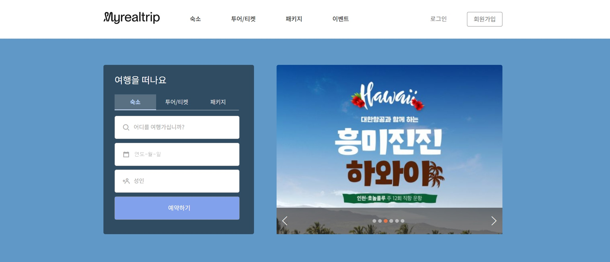
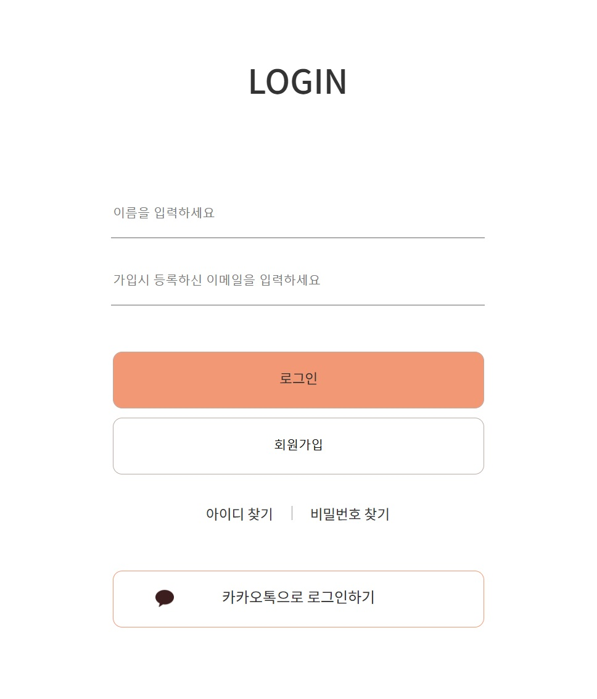
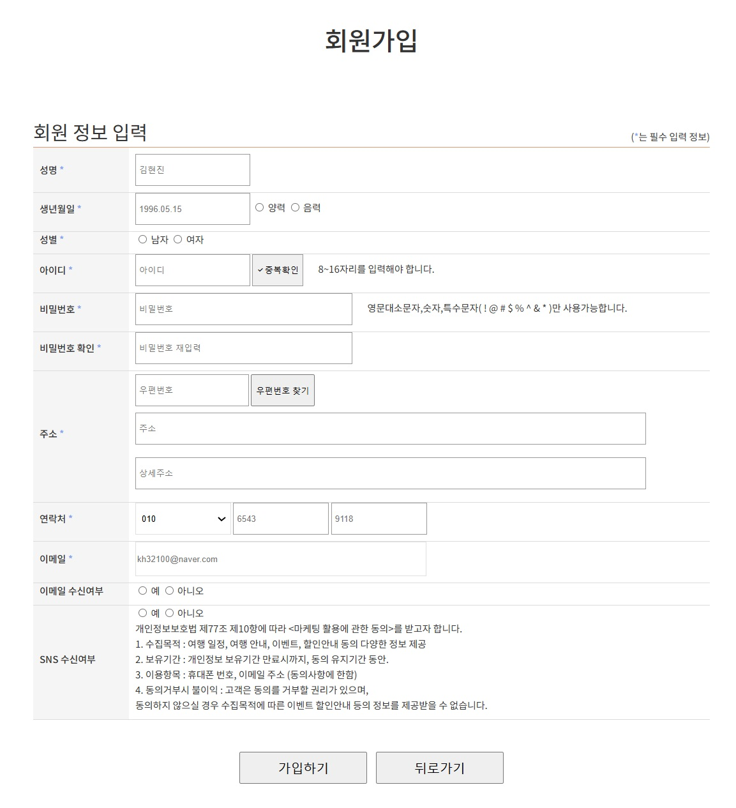

# 🗺️ 여행사 사이트 홈페이지 제작

> **팀프로젝트 (3명)**  
> **기술 스택**: HTML5, CSS3, JavaScript

---

### 담당 역할
본 프로젝트에서 **패키지 페이지**, **패키지 상세 페이지**, **로그인 페이지**, **회원가입 페이지**의 모든 디자인 및 기능 구현을 담당했습니다.  
카카오 API를 활용한 주소 검색 기능과 동적인 일정/비용 계산 기능을 개발하였습니다.

## 🌟 패키지 페이지

### 📋 주요 기능
- **패키지 목록**: 다양한 여행 패키지를 한눈에 확인하며, 가격과 주요 정보를 제공합니다.
- **상세 페이지 이동**: 각 패키지의 예약하기 버튼을 클릭하면 해당 패키지의 상세 페이지로 이동합니다.
- **유튜브 동영상**: 여행과 관련된 동영상을 제공하며, 클릭 시 동영상이 재생됩니다.

---

## 🌟 패키지 상세 페이지

### 📋 주요 기능
1. **패키지 정보**
   - 선택한 패키지의 상세 정보를 제공합니다.
   - 포함/불포함 사항, 이용 방법, 최소/최대 인원 등 필요한 정보를 확인할 수 있습니다.
   
2. **일정 관리**
   - 일정은 `1일차`, `2일차` 등 탭 형태로 구성되어 있으며,  
     각 일정 상세 정보는 `display: block`과 `none` 스타일을 활용하여 동적으로 표시됩니다.
   
3. **비용 계산**
   - 여행 인원을 선택하면 **인원 수에 따라 금액이 실시간으로 변동**됩니다.
   - 사용자는 정확한 여행 금액을 바로 확인할 수 있습니다.

---

## 🔑 로그인 페이지

### 📋 주요 기능
- **로그인 버튼**: 클릭 시 홈 화면으로 이동합니다.
- **회원가입 버튼**: 클릭 시 회원가입 페이지로 이동합니다.

---

## 📝 회원가입 페이지

### 📋 주요 기능
1. **우편번호 찾기**
   - **카카오 우편번호 서비스(API)**를 활용하여 사용자가 쉽게 우편번호와 주소를 검색하고 입력할 수 있습니다.
   
2. **버튼 기능**
   - **가입하기 버튼**: 클릭 시 홈 화면으로 이동합니다.
   - **뒤로가기 버튼**: 이전 페이지로 이동합니다.

---

## 🎨 프로젝트 요약
이 프로젝트는 **여행사 홈페이지** 제작을 목표로, 사용자 친화적인 디자인을 구현했습니다.  
심플한 디자인과 효율적인 기능 배치를 통해 **직관적인 사용자 경험(UX)**을 제공하며, 추가적으로 **카카오 API**를 활용해 편리함을 더했습니다.